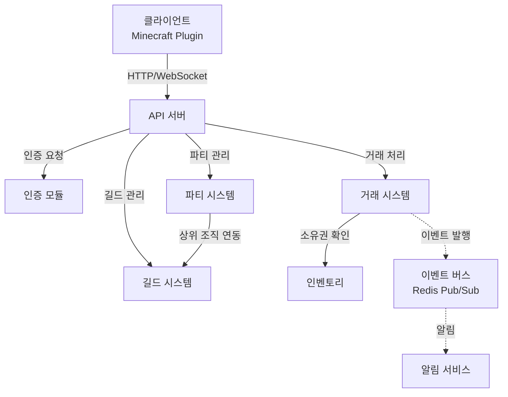
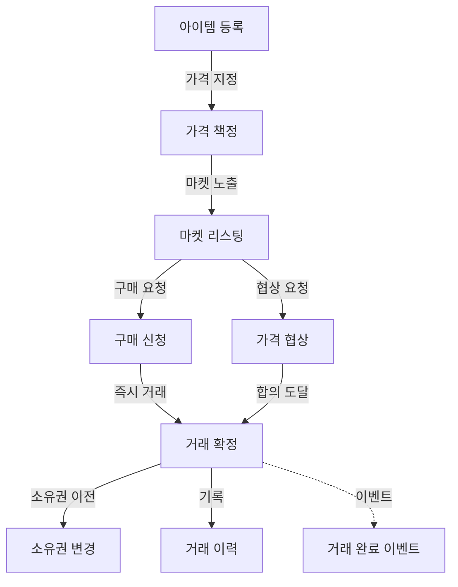
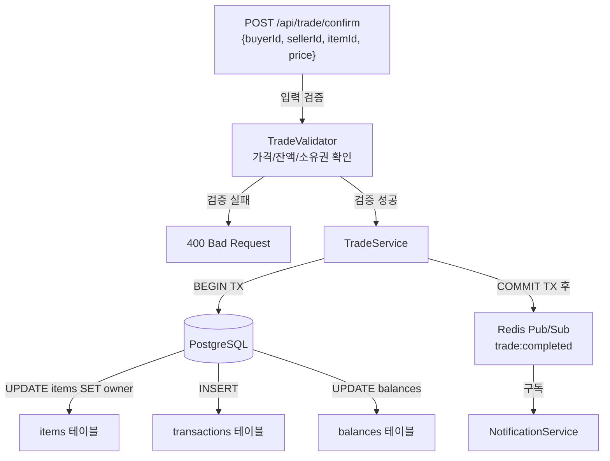
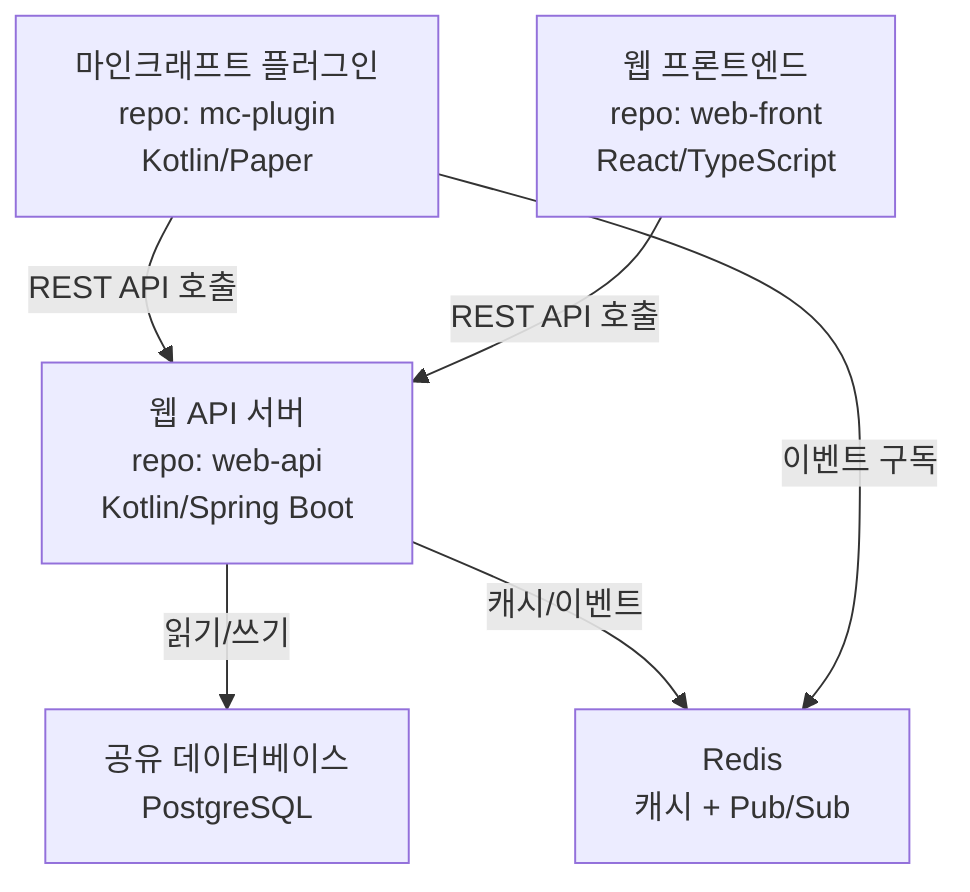
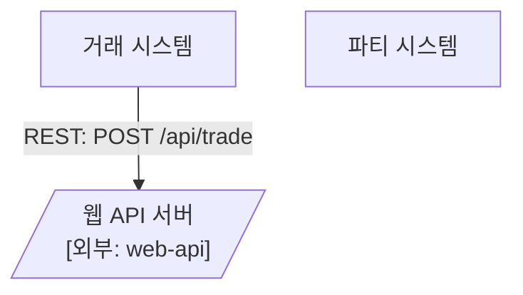

# Graph-Driven Development (GDD) v0.2

## AI 시대의 그래프 기반 소프트웨어 개발 프레임워크

---

## 1. GDD란 무엇인가

Graph-Driven Development(GDD)는 **그래프 문서가 프로젝트의 단일 진실 원천(Single Source of Truth)**이 되는 개발 방법론이다.

기존 방법론들이 텍스트 문서(SDD), 테스트 코드(TDD), 도메인 모델(DDD)을 중심으로 개발을 주도한다면, GDD는 **계층적 그래프**를 중심으로 설계, 구현, 유지보수의 전 과정을 주도한다.

### 핵심 원칙

| 원칙 | 설명 |
|------|------|
| **Graph as Truth** | 그래프에 없으면 존재하지 않는 것이다. 모든 기능, 의존성, 결정은 그래프에 반영된다. |
| **Zoom In / Zoom Out** | 하나의 시스템을 여러 깊이(Level)로 나누어 각 레벨에서 적절한 상세도를 유지한다. |
| **Node = Context Boundary** | 각 노드는 AI나 개발자가 한 번에 다룰 수 있는 컨텍스트의 단위다. |
| **Edge = Dependency Contract** | 노드 간 연결선은 단순한 화살표가 아니라 인터페이스 계약이다. |
| **Graph First, Code Second** | 코드를 먼저 쓰지 않는다. 그래프에 노드를 추가한 후 코드를 작성한다. |
| **Collocate, Don't Centralize** | 메타데이터는 거대한 단일 파일이 아니라 그래프와 함께 분산 배치한다. |

---

## 2. 프로젝트 디렉토리 구조

### v0.1의 문제: 중앙집중형 메타데이터

v0.1에서는 `nodes.yaml`과 `decisions.yaml`이 단일 파일이었다. 프로젝트가 커지면 이 파일들이 수백~수천 행이 되어 관리가 불가능해진다. 또한 `graph/` 폴더에 모든 레벨의 파일이 평탄하게 나열되어 파일 수가 폭발한다.

### v0.2 해결: 도메인별 분산 구조

```
my-project/
├── graph/
│   ├── L0-system.mermaid              # 시스템 전체 조감도 (유일하게 루트에 위치)
│   ├── L0-system.meta.yaml            # L0 노드 메타데이터
│   │
│   ├── auth/                          # 도메인별 하위 디렉토리
│   │   ├── L1-auth.mermaid            # 인증 기능 그래프
│   │   ├── L1-auth.meta.yaml          # 인증 도메인 메타데이터
│   │   ├── L2-login.mermaid           # 로그인 구현 그래프
│   │   ├── L2-login.meta.yaml
│   │   └── decisions/
│   │       └── DEC-auth-001.yaml      # 인증 관련 의사결정
│   │
│   ├── trading/                       # 거래 도메인
│   │   ├── L1-trading.mermaid
│   │   ├── L1-trading.meta.yaml
│   │   ├── L2-trade-confirm.mermaid
│   │   ├── L2-trade-confirm.meta.yaml
│   │   ├── L2-trade-register.mermaid
│   │   ├── L2-trade-register.meta.yaml
│   │   └── decisions/
│   │       ├── DEC-trade-001.yaml     # 동시성 제어 결정
│   │       └── DEC-trade-002.yaml     # 이벤트 브로커 결정
│   │
│   ├── party/
│   │   ├── L1-party.mermaid
│   │   ├── L1-party.meta.yaml
│   │   └── decisions/
│   │
│   └── guild/
│       ├── L1-guild.mermaid
│       ├── L1-guild.meta.yaml
│       └── decisions/
│
├── src/                               # 소스 코드
│   ├── auth/
│   ├── trading/
│   └── party/
│
├── .gdd.yaml                          # GDD 설정
└── gdd-lock.yaml                      # 자동 생성: 정합성 스냅샷 (섹션 7 참조)
```

### 핵심 변경점

**1. 그래프 파일과 메타 파일이 1:1 쌍으로 존재한다.**

`L1-trading.mermaid` 옆에 `L1-trading.meta.yaml`이 붙는다. 하나의 그래프에 대한 정보가 하나의 파일에 담긴다. 파일을 열었을 때 "이 그래프에 대한 모든 정보"가 한 곳에 있다.

**2. 도메인별 디렉토리로 분리한다.**

`graph/trading/`, `graph/auth/` 같은 하위 디렉토리로 나누어, 도메인이 10개가 되어도 각 디렉토리 안에는 3~6개 파일만 존재한다.

**3. 의사결정도 도메인별 디렉토리에 분산한다.**

`decisions/` 폴더가 각 도메인 아래에 위치한다. DEC 파일 하나가 의사결정 하나를 담는다.

---

## 3. 그래프 계층 (Graph Levels)

### Level 0 — 시스템 조감도

**목적**: 프로젝트에 어떤 도메인이 있고, 도메인 간 어떻게 연결되는지 보여준다.

**규칙**: 노드 수 3~10개. 각 노드는 하나의 도메인 또는 외부 시스템.



### Level 1 — 기능 그래프

**목적**: 하나의 도메인 내부에서 어떤 기능들이 있고, 기능 간 어떻게 흐르는지 보여준다.

**규칙**: 노드 수 4~12개. 각 노드는 하나의 사용자 기능 또는 내부 프로세스.



### Level 2 — 구현 그래프

**목적**: 하나의 기능이 실제 코드 단위(API, 서비스, DB)로 어떻게 구현되는지 보여준다.

**규칙**: 노드 수 4~15개. 각 노드는 API 엔드포인트, 클래스, DB 테이블, 외부 서비스.



---

## 4. 분산 메타데이터 시스템

### 그래프 메타 파일 (*.meta.yaml)

각 `.mermaid` 파일 옆에 같은 이름의 `.meta.yaml`이 존재한다.

**L0 메타 파일 예시** — `graph/L0-system.meta.yaml`:

```yaml
graph: L0-system.mermaid
level: 0
description: "마인크래프트 서버 전체 시스템 조감도"
last_updated: 2025-03-04

nodes:
  Trading:
    child_graph: trading/L1-trading.mermaid
    owner: "@devman-kr"
    status: active
    description: "플레이어 간 아이템 거래를 처리하는 도메인"
    tech_stack: ["Kotlin", "PostgreSQL", "Redis"]

  Auth:
    child_graph: auth/L1-auth.mermaid
    owner: "@devman-kr"
    status: active
    description: "JWT 기반 플레이어 인증"
    tech_stack: ["Kotlin", "Redis"]

  Party:
    child_graph: party/L1-party.mermaid
    owner: "@devman-kr"
    status: planned
    description: "일시적 플레이어 그룹 관리"

edges:
  - from: Trading
    to: Auth
    type: requires
    contract: "JWT 토큰 검증 필요"
  - from: Trading
    to: Inventory
    type: requires
    contract: "아이템 소유권 확인 API"
  - from: Trading
    to: EventBus
    type: event
    contract: "trade:completed 이벤트 발행"
```

**L1 메타 파일 예시** — `graph/trading/L1-trading.meta.yaml`:

```yaml
graph: L1-trading.mermaid
level: 1
parent_node: Trading                      # L0에서 어떤 노드의 하위인지
parent_graph: ../L0-system.mermaid
description: "거래 도메인 내부 기능 흐름"
last_updated: 2025-03-04

nodes:
  Confirm:
    child_graph: L2-trade-confirm.mermaid
    owner: "@devman-kr"
    status: active
    description: "구매자와 판매자의 합의 후 거래 최종 확정"
    api:
      method: POST
      path: /api/trade/confirm
      request: "{buyerId, sellerId, itemId, price}"
      response: "{tradeId, status, timestamp}"

  Register:
    child_graph: L2-trade-register.mermaid
    owner: "@devman-kr"
    status: active
    description: "아이템을 거래 시장에 등록"

edges:
  - from: Register
    to: PriceSet
    label: "가격 지정"
  - from: Confirm
    to: Transfer
    type: requires
    contract: "소유권 변경 완료 후 tradeId 반환"
```

**L2 메타 파일 예시** — `graph/trading/L2-trade-confirm.meta.yaml`:

```yaml
graph: L2-trade-confirm.mermaid
level: 2
parent_node: Confirm
parent_graph: L1-trading.mermaid
description: "거래 확정의 구현 상세"
last_updated: 2025-03-04

nodes:
  TradeValidator:
    owner: "@devman-kr"
    status: active
    source_file: "src/trading/validator/TradeValidator.kt"
    description: "거래 확정 전 입력값과 비즈니스 규칙 검증"
    validations:
      - "아이템이 판매자 소유인지 확인"
      - "구매자 잔액이 충분한지 확인"
      - "거래가 이미 완료되지 않았는지 확인"

  TradeService:
    owner: "@devman-kr"
    status: active
    source_file: "src/trading/service/TradeService.kt"
    description: "거래 트랜잭션 실행"

decisions:
  - ref: DEC-trade-001     # decisions/ 폴더의 파일 참조
  - ref: DEC-trade-002
```

### 의사결정 파일 (DEC-*.yaml)

하나의 결정 = 하나의 파일. 도메인별 `decisions/` 폴더에 위치한다.

**예시** — `graph/trading/decisions/DEC-trade-001.yaml`:

```yaml
id: DEC-trade-001
title: "거래 동시성 제어 방식"
date: 2025-03-01
status: accepted
related_nodes:
  - graph: L2-trade-confirm.mermaid
    node: TradeService

context: |
  동시에 같은 아이템에 대해 여러 거래가 진행될 수 있다.
  데이터 정합성과 성능 사이의 트레이드오프가 존재한다.

options:
  - name: "낙관적 락 (Optimistic Locking)"
    pros: ["높은 처리량", "락 대기 없음"]
    cons: ["충돌 시 재시도 필요", "재시도 로직 복잡"]
  - name: "비관적 락 (Pessimistic Locking)"
    pros: ["충돌 방지 보장", "구현 단순"]
    cons: ["락 대기 발생", "데드락 가능성"]

decision: "비관적 락 (SELECT FOR UPDATE)"
reason: "거래 특성상 충돌 빈도가 높고, 데이터 정합성이 최우선"

consequences:
  - "트랜잭션 타임아웃 설정 필요 (5초)"
  - "데드락 감지 및 자동 재시도 로직 구현"
```

### 스케일링 비교

| 항목 | v0.1 (중앙집중) | v0.2 (분산) |
|------|----------------|-------------|
| 도메인 5개, 기능 30개 | nodes.yaml ~500행 | 파일당 ~30행, 15개 파일 |
| 도메인 15개, 기능 100개 | nodes.yaml ~2000행 | 파일당 ~30행, 45개 파일 |
| 의사결정 50개 | decisions.yaml ~1500행 | 파일당 ~30행, 50개 파일 |
| 특정 도메인 수정 시 | 전체 파일에서 해당 부분 탐색 | 해당 도메인 디렉토리만 열기 |
| Git 충돌 가능성 | 매우 높음 (모두 같은 파일 수정) | 매우 낮음 (도메인별 파일 분리) |

---

## 5. 그래프-코드 동기화 강제 시스템

"Graph First"가 규칙으로만 존재하면 결국 깨진다. 이를 방지하기 위해 세 단계의 강제 메커니즘을 설계한다.

### 5.1 레이어 1 — 코드 내 어노테이션

소스 코드에 GDD 노드 매핑을 어노테이션으로 강제한다.

**Kotlin 예시:**

```kotlin
/**
 * @gdd-node TradeValidator
 * @gdd-graph trading/L2-trade-confirm.mermaid
 */
class TradeValidator {
    // ...
}
```

**TypeScript 예시:**

```typescript
/**
 * @gdd-node TradeService
 * @gdd-graph trading/L2-trade-confirm.mermaid
 */
export class TradeService {
    // ...
}
```

이 어노테이션이 있어야 lint가 통과한다. "그래프에 없는 코드"가 생기는 것을 방지한다.

### 5.2 레이어 2 — Git Hook (Pre-commit)

커밋 시점에 자동으로 정합성을 검사한다.

```bash
#!/bin/bash
# .githooks/pre-commit

# 1. 변경된 소스 파일에서 @gdd-node 어노테이션 추출
changed_nodes=$(git diff --cached --name-only -- 'src/' | \
  xargs grep -l '@gdd-node' 2>/dev/null | \
  xargs grep '@gdd-node' | \
  sed 's/.*@gdd-node //' | sort -u)

# 2. 변경된 그래프 파일 확인
changed_graphs=$(git diff --cached --name-only -- 'graph/')

# 3. 코드는 변경되었는데 대응하는 그래프가 변경되지 않았으면 경고
for node in $changed_nodes; do
  graph_file=$(grep -r "source_file.*$(git diff --cached --name-only -- 'src/' | head -1)" \
    graph/ --include="*.meta.yaml" -l 2>/dev/null)
  if [ -n "$graph_file" ] && ! echo "$changed_graphs" | grep -q "$(dirname $graph_file)"; then
    echo "⚠️  WARNING: '$node' 코드가 변경되었지만 그래프가 업데이트되지 않았습니다."
    echo "   그래프 업데이트가 필요하지 않다면 --no-verify로 건너뛸 수 있습니다."
    echo "   관련 그래프: $graph_file"
    # exit 1  # 엄격 모드에서는 커밋 차단
  fi
done

# 4. 그래프가 변경되었으면 gdd-lock.yaml 재생성
if [ -n "$changed_graphs" ]; then
  echo "📊 그래프 변경 감지. gdd-lock.yaml 업데이트 중..."
  gdd validate --update-lock
  git add gdd-lock.yaml
fi

echo "✅ GDD 동기화 검사 완료"
```

### 5.3 레이어 3 — CI 파이프라인 (Pull Request)

CI에서 전체 정합성을 검사하고 PR을 차단한다. 이것이 최종 방어선이다.

```yaml
# .github/workflows/gdd-validate.yml

name: GDD Validation
on: [pull_request]

jobs:
  gdd-check:
    runs-on: ubuntu-latest
    steps:
      - uses: actions/checkout@v4

      - name: GDD 정합성 검사
        run: gdd validate --strict

      - name: 고아 코드 검사
        run: |
          # @gdd-node가 없는 주요 클래스/파일 검출
          gdd orphans --fail-on-found

      - name: 고아 노드 검사
        run: |
          # 그래프에는 있지만 코드가 없는 노드 검출 (status=active인데 source_file 없음)
          gdd ghosts --fail-on-found

      - name: 순환 의존성 검사
        run: gdd cycles --fail-on-found

      - name: 그래프 시각화 생성
        run: |
          gdd render --output pr-artifacts/
          # PR 코멘트에 변경된 그래프 이미지 첨부
```

### 동기화 강제 수준 선택

프로젝트 성숙도에 따라 강제 수준을 조절한다.

```yaml
# .gdd.yaml 내 설정

sync:
  enforcement: warn          # warn | soft | strict

  # warn: 경고만 출력 (프로젝트 초기, 팀 적응기)
  #   - pre-commit: 경고 메시지 출력, 커밋 허용
  #   - CI: 경고 출력, PR 머지 허용

  # soft: 선택적 차단 (팀이 익숙해진 후)
  #   - pre-commit: 경고 + 확인 프롬프트
  #   - CI: 새 파일에 @gdd-node 없으면 PR 차단

  # strict: 전면 차단 (프로덕션 프로젝트)
  #   - pre-commit: 검증 실패 시 커밋 차단
  #   - CI: 모든 정합성 검사 통과해야 PR 머지 가능
```

---

## 6. AI 컨텍스트 공급 전략

### 작업 유형별 컨텍스트 매트릭스

```
┌─────────────────────┬──────────────────────────────────────────────────┐
│ 작업 유형            │ AI에게 제공할 파일                                 │
├─────────────────────┼──────────────────────────────────────────────────┤
│ 전체 구조 파악       │ L0 그래프 + L0 메타                               │
│ 기능 설계           │ L0 + 해당 L1 + L1 메타                            │
│ 코드 구현           │ L0 + L1 + L2 + L2 메타 + 관련 DEC                 │
│ 버그 수정           │ 해당 L2 + 연결된 L2들 + L2 메타들                   │
│ 리팩토링            │ L0 + 관련 L1들 + 관련 DEC들                        │
│ 새 도메인 추가       │ L0 + L0 메타 + 관련 DEC들                         │
│ 크로스 도메인 기능    │ L0 + 관련 L1들 + 양쪽 L1 메타 + 관련 DEC           │
└─────────────────────┴──────────────────────────────────────────────────┘
```

### 프롬프트 템플릿 예시

```markdown
## GDD 컨텍스트

### 시스템 전체 구조
[L0-system.mermaid 내용 붙여넣기]

### 작업 대상 도메인
[L1-trading.mermaid 내용 붙여넣기]

### 구현 상세
[L2-trade-confirm.mermaid 내용 붙여넣기]
[L2-trade-confirm.meta.yaml 내용 붙여넣기]

### 관련 의사결정
[DEC-trade-001.yaml 내용 붙여넣기]

## 작업 요청
위 그래프 구조를 기반으로 TradeService의 거래 확정 로직을 구현해주세요.
그래프에 정의된 의존성과 계약(contract)을 준수해야 합니다.
```

---

## 7. 정합성 검사 (Validation)

### 7.1 검사 항목

`gdd validate` 명령은 다음 항목들을 검사한다.

**구조 검사 (Structure)**

| 검사 | 설명 | 심각도 |
|------|------|--------|
| `orphan-node` | 엣지가 하나도 없는 노드 | error |
| `orphan-code` | `@gdd-node` 어노테이션이 없는 주요 클래스 | warning |
| `ghost-node` | status=active인데 source_file이 존재하지 않는 노드 | error |
| `missing-meta` | `.mermaid` 파일에 대응하는 `.meta.yaml`이 없음 | error |
| `missing-child` | child_graph로 지정된 파일이 존재하지 않음 | error |
| `max-nodes` | 레벨별 최대 노드 수 초과 | warning |

**관계 검사 (Relationship)**

| 검사 | 설명 | 심각도 |
|------|------|--------|
| `circular-dep` | 순환 의존성 감지 | error |
| `missing-contract` | requires 타입 엣지에 contract이 비어 있음 | warning |
| `cross-level-ref` | L2 노드가 다른 도메인의 L2를 직접 참조 | error |
| `broken-parent` | parent_graph가 가리키는 파일이 없음 | error |

**일관성 검사 (Consistency)**

| 검사 | 설명 | 심각도 |
|------|------|--------|
| `mermaid-meta-mismatch` | .mermaid의 노드와 .meta.yaml의 노드 목록 불일치 | error |
| `stale-decision` | status=accepted인 DEC의 related_nodes가 deprecated 노드를 가리킴 | warning |
| `source-file-exists` | meta.yaml의 source_file 경로에 실제 파일이 존재하는지 | error |

### 7.2 gdd-lock.yaml

Git의 lock 파일처럼, 그래프 전체의 스냅샷을 자동 생성한다. CI에서 이 파일과 실제 그래프를 비교하여 불일치를 감지한다.

```yaml
# gdd-lock.yaml (자동 생성 — 직접 수정하지 않는다)

generated_at: 2025-03-04T12:00:00Z
gdd_version: 0.2.0

graph_checksum:
  L0-system.mermaid: "sha256:a1b2c3..."
  trading/L1-trading.mermaid: "sha256:d4e5f6..."
  trading/L2-trade-confirm.mermaid: "sha256:g7h8i9..."

node_index:
  # 모든 노드의 플랫 인덱스 (빠른 참조용)
  Trading: { level: 0, graph: "L0-system.mermaid", status: active }
  Confirm: { level: 1, graph: "trading/L1-trading.mermaid", status: active }
  TradeValidator: { level: 2, graph: "trading/L2-trade-confirm.mermaid", status: active }
  # ...

dependency_tree:
  Trading:
    requires: [Auth, Inventory]
    events: [EventBus]
  Confirm:
    requires: [Transfer]
  # ...

validation_result:
  errors: 0
  warnings: 2
  details:
    - type: warning
      check: missing-contract
      location: "L1-party.meta.yaml"
      message: "Party -> Guild 엣지에 contract이 비어 있음"
    - type: warning
      check: orphan-code
      location: "src/trading/util/PriceCalculator.kt"
      message: "@gdd-node 어노테이션 없음"
```

---

## 8. MCP 서버를 통한 자동화 (로드맵)

GDD의 그래프/메타데이터를 MCP(Model Context Protocol) 서버로 노출하면, AI 코딩 에이전트가 수동 파일 지정 없이 자동으로 컨텍스트를 가져갈 수 있다.

### 8.1 아키텍처

```
┌──────────────┐     MCP Protocol      ┌──────────────────┐
│  AI Agent    │ ◄────────────────────► │   GDD MCP Server │
│  (Claude,    │   tool call / result   │                  │
│   Cursor,    │                        │  ┌────────────┐  │
│   Copilot)   │                        │  │ Graph      │  │
│              │                        │  │ Parser     │  │
└──────────────┘                        │  └────────────┘  │
                                        │  ┌────────────┐  │
                                        │  │ Meta       │  │
                                        │  │ Resolver   │  │
                                        │  └────────────┘  │
                                        │  ┌────────────┐  │
                                        │  │ Validator  │  │
                                        │  └────────────┘  │
                                        │  ┌────────────┐  │
                                        │  │ File       │  │
                                        │  │ Watcher    │  │
                                        │  └────────────┘  │
                                        └──────────────────┘
                                                 │
                                                 ▼
                                        ┌──────────────────┐
                                        │   graph/         │
                                        │   src/           │
                                        │   .gdd.yaml      │
                                        └──────────────────┘
```

### 8.2 MCP 도구 (Tools) 정의

```yaml
tools:
  # --- 그래프 탐색 ---
  gdd_get_overview:
    description: "L0 시스템 그래프와 메타데이터를 반환한다"
    params: {}
    returns: "L0-system.mermaid + L0-system.meta.yaml 내용"

  gdd_get_domain:
    description: "특정 도메인의 L1 그래프와 메타데이터를 반환한다"
    params:
      domain: string    # "trading", "auth", "party", ...
    returns: "해당 L1 그래프 + 메타 + 관련 DEC 목록"

  gdd_get_implementation:
    description: "특정 기능의 L2 구현 그래프와 메타데이터를 반환한다"
    params:
      domain: string
      feature: string   # 노드 이름
    returns: "해당 L2 그래프 + 메타 + 관련 DEC 내용"

  gdd_get_context:
    description: "작업 유형에 따라 최적의 컨텍스트를 자동 조합하여 반환한다"
    params:
      task_type: enum   # overview | design | implement | debug | refactor
      target_node: string
    returns: "필요한 그래프 + 메타 + DEC를 자동 조합한 컨텍스트"

  gdd_trace_dependencies:
    description: "특정 노드의 상위/하위 의존성 체인을 추적한다"
    params:
      node: string
      direction: enum   # upstream | downstream | both
      depth: integer    # 추적 깊이 (기본 2)
    returns: "의존성 트리 + 관련 contract 목록"

  # --- 그래프 수정 ---
  gdd_add_node:
    description: "그래프에 새 노드를 추가하고 메타데이터를 생성한다"
    params:
      graph: string       # 대상 그래프 파일
      node_id: string
      label: string
      edges_to: list      # [{target, label, type}]
      meta: object        # 메타데이터
    returns: "수정된 그래프 + 메타 파일"

  gdd_update_status:
    description: "노드의 상태를 변경한다"
    params:
      node: string
      new_status: enum    # active | planned | deprecated
    returns: "업데이트 결과"

  # --- 검증 ---
  gdd_validate:
    description: "전체 그래프의 정합성을 검사한다"
    params:
      scope: enum         # all | domain | file
      target: string      # scope=domain일 때 도메인 이름
    returns: "검증 결과 (errors, warnings, details)"

  gdd_check_impact:
    description: "특정 노드를 변경할 때 영향받는 노드들을 반환한다"
    params:
      node: string
      change_type: enum   # modify | deprecate | delete
    returns: "영향받는 노드 목록 + 관련 contract 목록"
```

### 8.3 AI 에이전트 워크플로우 예시

MCP 서버가 활성화된 상태에서 AI에게 "길드 상점 기능 추가해줘"라고 요청하면:

```
1. AI가 gdd_get_overview() 호출
   → L0 그래프를 읽고 전체 구조 파악

2. AI가 gdd_get_domain("trading") 호출
   → Trading 도메인의 기능 목록과 의존성 파악

3. AI가 gdd_trace_dependencies("Guild", direction="downstream") 호출
   → Guild 노드와 연결된 모든 노드 파악

4. AI가 gdd_add_node() 호출
   → L1-trading.mermaid에 GuildShop 노드 추가
   → L1-trading.meta.yaml에 메타데이터 추가

5. AI가 gdd_validate(scope="domain", target="trading") 호출
   → 새 노드 추가 후 정합성 확인

6. AI가 L2 구현 그래프 생성 및 코드 작성
   → @gdd-node 어노테이션 포함
```

사람이 하던 "어떤 파일을 컨텍스트로 줘야 하지?" 판단을 AI가 MCP 도구를 통해 스스로 수행한다.

---

## 9. 다중 모듈 및 이기종 시스템 대응

### 9.1 문제 정의

실제 프로젝트는 단일 저장소가 아닌 경우가 많다.

- 마인크래프트 Plugin (Kotlin) + Web API (Kotlin/Spring) + 프론트엔드 (React)
- 모노레포 내 여러 서브 모듈
- 마이크로서비스 간 통신

### 9.2 시스템 연합 (System Federation)

여러 저장소/모듈에 걸친 GDD를 하나의 논리적 그래프로 연결한다.

**Level -1 — 시스템 연합 그래프 도입**

기존 L0 위에 하나의 레벨을 더 추가한다. 이 레벨은 선택적이며, 다중 시스템을 운영하는 경우에만 사용한다.



**연합 설정 파일** — `.gdd-federation.yaml` (조직 레벨 또는 별도 저장소):

```yaml
# .gdd-federation.yaml

federation:
  name: "minecraft-platform"
  version: "0.1.0"

systems:
  mc-plugin:
    repository: "github.com/yun/mc-plugin"
    gdd_root: "graph/"
    L0_graph: "L0-system.mermaid"
    tech: "Kotlin/Paper"
    role: "게임 내 플러그인"

  web-api:
    repository: "github.com/yun/web-api"
    gdd_root: "graph/"
    L0_graph: "L0-system.mermaid"
    tech: "Kotlin/Spring Boot"
    role: "REST API 서버"

  web-front:
    repository: "github.com/yun/web-front"
    gdd_root: "graph/"
    L0_graph: "L0-system.mermaid"
    tech: "React/TypeScript"
    role: "웹 프론트엔드"

contracts:
  # 시스템 간 계약 정의
  - from: mc-plugin
    to: web-api
    protocol: REST
    contract_file: "contracts/mc-to-api.yaml"     # OpenAPI 스펙 등
    description: "플러그인이 웹 API를 호출할 때의 인터페이스"

  - from: web-front
    to: web-api
    protocol: REST
    contract_file: "contracts/front-to-api.yaml"

  - from: web-api
    to: mc-plugin
    protocol: "Redis Pub/Sub"
    contract_file: "contracts/api-events.yaml"
    description: "서버 → 플러그인 이벤트 채널"
```

### 9.3 이기종 그래프 레벨 매핑

각 시스템(저장소)은 자체 GDD 구조를 갖되, 시스템 간 경계에서는 `contract_file`로 연결한다.

```
                     .gdd-federation.yaml
                              │
              ┌───────────────┼───────────────┐
              ▼               ▼               ▼
         mc-plugin/       web-api/        web-front/
         graph/           graph/          graph/
         ├─ L0            ├─ L0           ├─ L0
         ├─ L1-*          ├─ L1-*         ├─ L1-*
         └─ L2-*          └─ L2-*         └─ L2-*

각 저장소의 L0에는 다른 시스템을 "외부 시스템" 노드로 표현:

mc-plugin의 L0:
    ┌──────────────────┐
    │ Trading (내부)    │──── WebAPI [외부 시스템]
    │ Party (내부)      │
    │ Guild (내부)      │
    └──────────────────┘

web-api의 L0:
    ┌──────────────────┐
    │ TradeAPI (내부)   │──── MCPlugin [외부 시스템]
    │ UserAPI (내부)    │──── WebFront [외부 시스템]
    └──────────────────┘
```

**외부 시스템 노드 표기법 (Mermaid):**



---

## 10. 기존 방법론과의 결합

GDD는 기존 방법론을 **대체하지 않고 연결하는 역할**을 한다.

### GDD + TDD

그래프의 엣지(계약)가 테스트 케이스의 근거가 된다.

```
엣지: Trading --"JWT 토큰 검증 필요"--> Auth
  → 테스트: "토큰 없이 거래 요청 시 401 반환"
  → 테스트: "만료된 토큰으로 거래 요청 시 401 반환"
  → 테스트: "유효한 토큰으로 거래 요청 시 200 반환"
```

### GDD + DDD

```
L0 노드     = Bounded Context
L1 노드     = Aggregate / Domain Service
L2 노드     = Entity / Value Object / Repository
엣지        = Context Mapping
contract    = Published Language
```

### GDD + ADR

decisions/ 폴더의 각 DEC 파일이 곧 ADR이며, 특정 그래프 노드에 연결되어 "왜 이렇게 구현했는가"를 추적한다.

---

## 11. GDD 워크플로우

### 새 기능 추가 흐름

```
1. Graph First
   └─ L1 그래프에 새 노드 추가
   └─ 기존 노드와의 엣지(의존성) 정의
   └─ .meta.yaml에 메타데이터 기록

2. Decision Point
   └─ 설계 결정이 필요하면 decisions/ 폴더에 DEC 파일 생성
   └─ 선택지, 트레이드오프, 최종 결정을 명시

3. Zoom In
   └─ 필요하면 L2 구현 그래프 + 메타 파일 생성
   └─ API, 서비스, DB 단위의 노드 배치

4. Code
   └─ L2 그래프를 보고 코드 작성
   └─ @gdd-node 어노테이션 포함
   └─ AI에게는 gdd_get_context() 또는 수동으로 파일 조합

5. Verify
   └─ pre-commit hook이 동기화 확인
   └─ CI에서 gdd validate --strict 실행
   └─ gdd-lock.yaml 자동 업데이트
```

### 그래프 유지보수 규칙

1. **코드보다 그래프를 먼저 수정한다.**
2. **고아 노드를 허용하지 않는다.** 어떤 노드도 최소 하나의 엣지를 가져야 한다.
3. **레벨 간 매핑을 유지한다.** L0 노드 → L1 파일, L1 노드 → L2 파일.
4. **deprecated 노드는 삭제하지 않는다.** status 변경 + 엣지를 점선으로 전환.
5. **순환 의존성이 발생하면 이벤트 기반으로 분리한다.**
6. **메타 파일은 그래프 파일과 항상 쌍으로 존재한다.**

---

## 12. 로드맵

| 단계 | 목표 | 상태 |
|------|------|------|
| **v0.1** | 개념 정립, 기본 구조 설계 | ✅ 완료 |
| **v0.2** | 분산 메타데이터, 동기화 강제, 정합성 검사, 다중 시스템 | ✅ 현재 |
| **v0.3** | CLI 도구 (`gdd` 명령어) 구현 | 🔜 다음 |
| **v0.4** | MCP 서버 구현 (AI 에이전트 자동화) | 📋 계획 |
| **v0.5** | VS Code / IDE 확장 (그래프 시각화, 노드 클릭 → 코드 점프) | 📋 계획 |
| **v1.0** | 프로덕션 안정화, 문서화, 커뮤니티 공개 | 📋 계획 |

---

## 부록 A: 빠른 시작 체크리스트

- [ ] 프로젝트 루트에 `graph/` 디렉토리 생성
- [ ] `graph/L0-system.mermaid` 작성 — 도메인 3~8개 배치
- [ ] `graph/L0-system.meta.yaml` 작성 — L0 노드별 메타데이터
- [ ] `.gdd.yaml` 설정 파일 생성
- [ ] 첫 번째 도메인 디렉토리 생성 (`graph/trading/`)
- [ ] `L1-*.mermaid` + `L1-*.meta.yaml` 작성
- [ ] 소스 코드에 `@gdd-node` 어노테이션 추가
- [ ] `.githooks/pre-commit` 설정
- [ ] AI에게 작업 시 적절한 레벨의 파일을 컨텍스트로 제공
- [ ] 코드 변경 후 그래프가 최신 상태인지 확인

## 부록 B: .gdd.yaml 전체 예시

```yaml
project:
  name: "minecraft-server"
  version: "0.2.0"

graph:
  directory: "graph/"
  format: "mermaid"               # mermaid | d2 | structurizr

levels:
  L0:
    max_nodes: 10
    description: "시스템 전체 도메인 맵"
  L1:
    max_nodes: 12
    description: "도메인 내부 기능 흐름"
  L2:
    max_nodes: 15
    description: "기능의 구현 단위"

conventions:
  node_naming: "PascalCase"
  edge_labels: true
  orphan_nodes: false
  circular_dependency: false

sync:
  enforcement: warn               # warn | soft | strict
  annotation_pattern: "@gdd-node"
  source_directories:
    - "src/"
  ignore_patterns:
    - "src/**/test/**"
    - "src/**/util/**"

ai_context:
  always_include:
    - "graph/L0-system.mermaid"
    - "graph/L0-system.meta.yaml"
  max_context_files: 8

federation:
  enabled: false
  config: ".gdd-federation.yaml"
```
